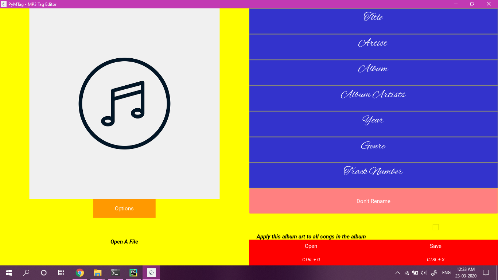

# PyMTag
MP3 Tag Editor in Python

 

Libraries Used for the App:

<ul>
<li> GUI Python Framework &rarr; <a href=https://github.com/kivy/kivy> Kivy</a> 
<li> ID3 Editing Support &rarr; <a href=https://github.com/quodlibet/mutagen/> Mutagen</a>
</ul> 
