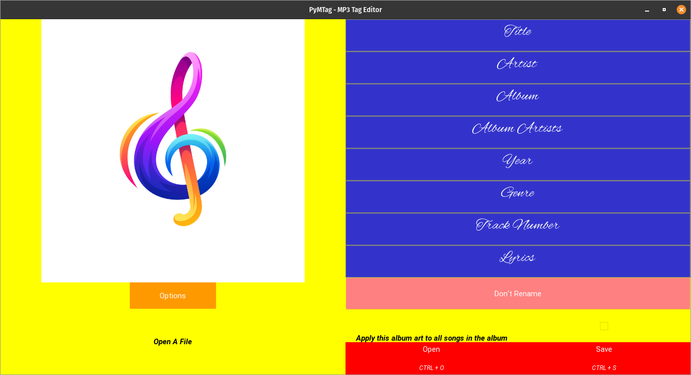

# PyMTag
MP3 Tag Editor in Python

 

## Libraries Used for the App:

* [Python Kivy GUI Framework](https://github.com/kivy/kivy)
* [Mutagen - MP3 ID3 Editing Support](https://github.com/quodlibet/mutagen/)
